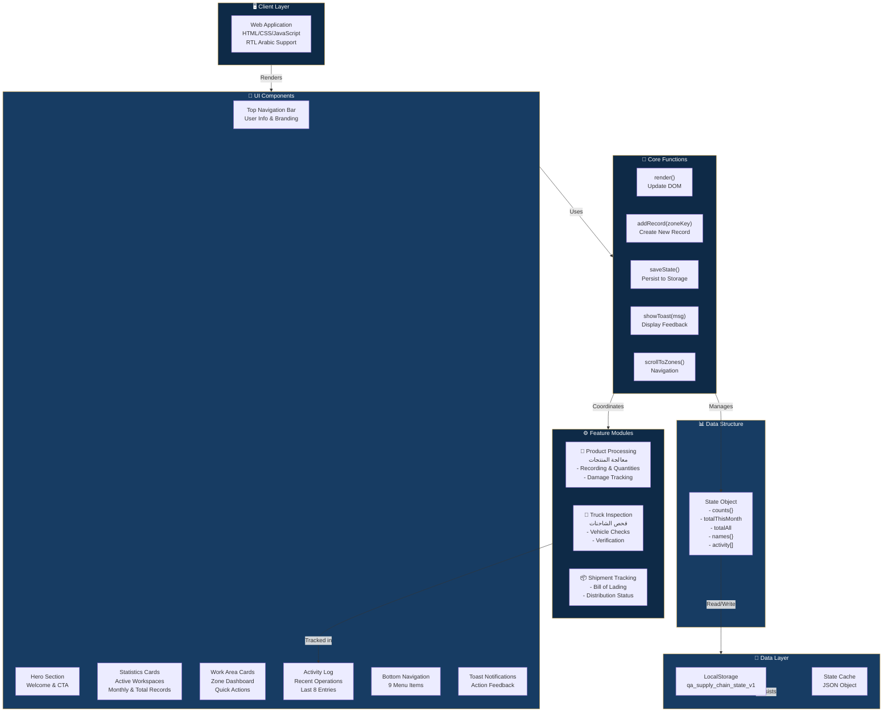

# Quality Management - Supply Chain Architecture

## System Overview

This document provides an architectural overview of the Quality Management System for Supply Chain Operations.

## Architecture Diagram



## Component Breakdown

### 🖥️ Client Layer
- **Single-page HTML application** with inline CSS and JavaScript
- **RTL Arabic support** (lang="ar" dir="rtl")
- **Mobile-responsive** design with safe-area inset support
- **Dark theme** with navy, gold, and light accent colors

### 💾 Data Layer
- **LocalStorage persistence** with key `qa_supply_chain_state_v1`
- **Client-side state management** with JSON serialization
- **Default state** includes counts, statistics, zone names, and activity log

### ⚙️ Feature Modules
Three main operational zones:
1. **معالجة المنتجات** (Product Processing) - 60 records
2. **فحص الشاحنات** (Truck Inspection) - 236 records
3. **Shipment Tracking** - 53 records

### 🎨 UI Components
- **Topbar**: Branding and user identification
- **Hero**: Welcome section with call-to-action
- **Stats**: Dashboard metrics (active workspaces, monthly/total records)
- **Zones**: Feature cards with actions (new record, open log)
- **Activity Log**: Recent operations list
- **Bottom Navigation**: 9-item menu bar
- **Toast Notifications**: Feedback mechanism

### 🔧 Core Functions
- `render()` - DOM update and state visualization
- `addRecord(zoneKey)` - Create new records and update counts
- `saveState()` - LocalStorage persistence with error handling
- `showToast(msg)` - Temporal notification display
- `scrollToZones()` - Smooth navigation

### 📊 Data Structure
```javascript
{
  counts: {processing, shipments, shipment2},
  totalThisMonth: number,
  totalAll: number,
  names: {zoneKey: "Arabic Name"},
  activity: [{id, zone, date}, ...]
}
```

## Technology Stack

| Layer | Technology |
|-------|-----------|
| Frontend | HTML5, CSS3, Vanilla JavaScript |
| Styling | CSS Grid, Flexbox, CSS Variables |
| Fonts | Google Fonts (Cairo - Arabic) |
| Storage | Browser LocalStorage API |
| Responsiveness | Media Queries, Viewport Meta |
| Accessibility | RTL Support, semantic HTML |

## Data Flow

1. **Initialization** → Load saved state from LocalStorage or use defaults
2. **User Action** → Click "سجل جديد" (New Record) button
3. **Processing** → `addRecord()` updates state object
4. **Persistence** → `saveState()` writes to LocalStorage
5. **Rendering** → `render()` updates DOM elements
6. **Feedback** → `showToast()` confirms action

## Key Features

✅ **Persistent Storage** - Data survives page reloads  
✅ **Real-time Updates** - Instant UI feedback  
✅ **Arabic-First Design** - RTL layout and bilingual content  
✅ **Mobile Optimized** - Responsive layout and safe-area support  
✅ **Error Handling** - Try-catch blocks for storage operations  
✅ **Activity Tracking** - Automatic logging with timestamps  

## Future Enhancement Opportunities

- 🔗 Backend API integration for cloud sync
- 📱 Progressive Web App (PWA) capabilities
- 🔐 User authentication and authorization
- 📈 Advanced analytics and reporting
- 🔔 Server-side notifications
- 📲 Mobile app version
